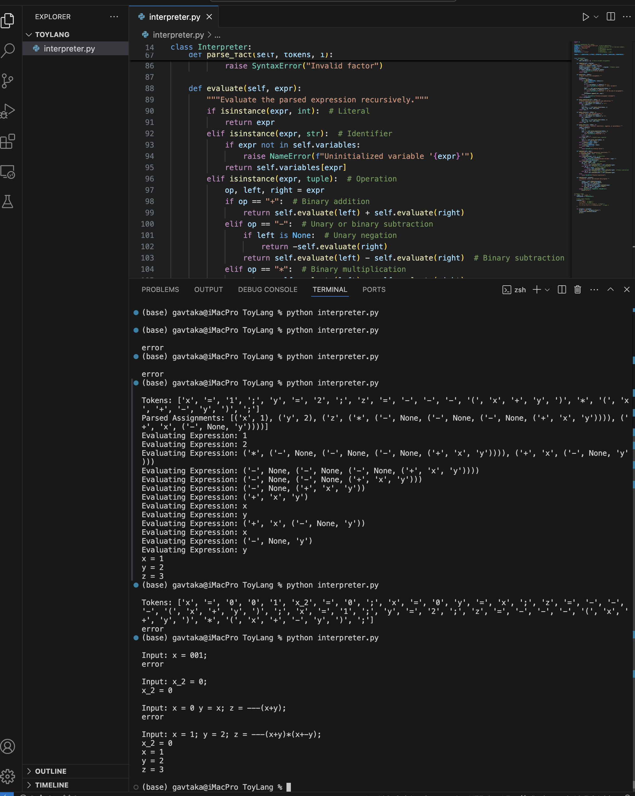

# ToyLang Interpreter

ToyLang is a simple interpreter for a toy programming language written in Python. It demonstrates how to tokenize, parse, and evaluate expressions using a custom-designed language.

---

## Features

- **Variable Assignments**: Assign values to variables using `=` and terminate statements with `;`.
- **Basic Arithmetic Operations**: Supports addition (`+`), subtraction (`-`), and multiplication (`*`).
- **Parentheses**: Allows grouping of expressions using parentheses.
- **Unary Negation**: Handles unary negation with `-`.

---

## Example Usage

### Input
```plaintext
x = 1;
y = 2;
z = ---(x + y) * (x + -y);
'''
### Output



